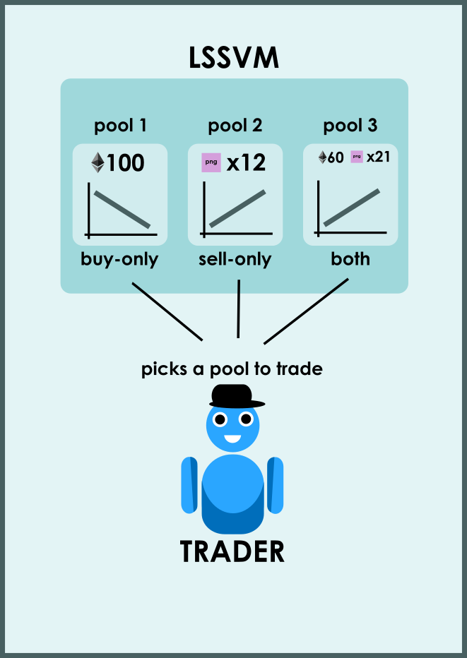
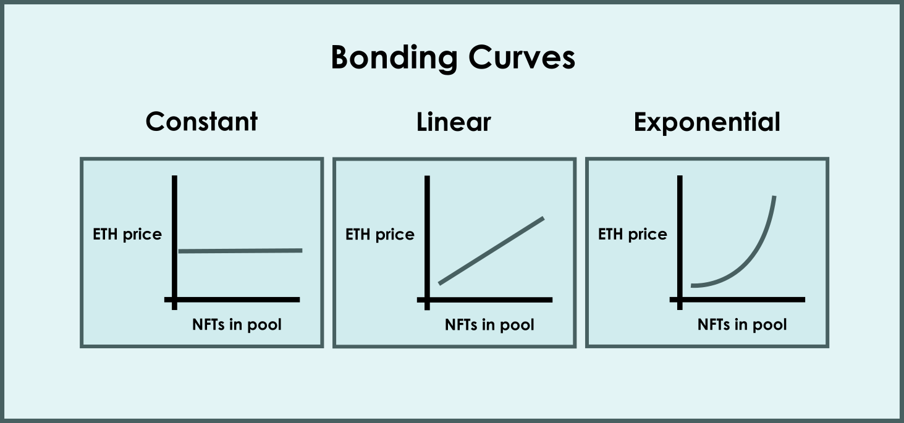

# sudoswap-analysis

## sudoswap 阶段一：OTC

[https://otc.sudoswap.xyz](https://otc.sudoswap.xyz)

sudoswap自定义的点对点交易形式是一种灵活交易订单，支持选择指定对手方地址和到期日，然后点击「create swap」即可生成一个交易链接，当你把这个链接分享给你的交易对手时，对方可以通过链接进入交易。当然对方也可以链接自己的钱包到sudoswap后在平台内看到这笔交易。简单来说就是一种场外交易的形式。提供订单撮合的功能。

特点：
1. 基于 0x v2 协议构建（[0x080bf510fcbf18b91105470639e9561022937712](https://etherscan.io/address/0x080bf510fcbf18b91105470639e9561022937712)）
2. 自定义的点对点交易形式
3. 支持 ERC20、ERC721、ERC1155 等代币任意组合的交易
4. 无交易手续费和版税

### 解析

0x 协议的 v2 版本，跟 opensea 的 seaport 协议一样，是中央订单簿的交易模型。都是由链下的中心化的订单簿和链上的交易组成。

其中链下的订单簿负责存储用户的挂单信息，并对订单进行撮合。最终的成交和转移 NFT 是由 Seaport Protocol 来负责的。

#### order

其中订单在合约中的对应下面的结构：

```
struct Order {
        address makerAddress;           // Address that created the order.      
        address takerAddress;           // Address that is allowed to fill the order. If set to 0, any address is allowed to fill the order.          
        address feeRecipientAddress;    // Address that will recieve fees when order is filled.      
        address senderAddress;          // Address that is allowed to call Exchange contract methods that affect this order. If set to 0, any address is allowed to call these methods.
        uint256 makerAssetAmount;       // Amount of makerAsset being offered by maker. Must be greater than 0.        
        uint256 takerAssetAmount;       // Amount of takerAsset being bid on by maker. Must be greater than 0.        
        uint256 makerFee;               // Amount of ZRX paid to feeRecipient by maker when order is filled. If set to 0, no transfer of ZRX from maker to feeRecipient will be attempted.
        uint256 takerFee;               // Amount of ZRX paid to feeRecipient by taker when order is filled. If set to 0, no transfer of ZRX from taker to feeRecipient will be attempted.
        uint256 expirationTimeSeconds;  // Timestamp in seconds at which order expires.          
        uint256 salt;                   // Arbitrary number to facilitate uniqueness of the order's hash.     
        bytes makerAssetData;           // Encoded data that can be decoded by a specified proxy contract when transferring makerAsset. The last byte references the id of this proxy.
        bytes takerAssetData;           // Encoded data that can be decoded by a specified proxy contract when transferring takerAsset. The last byte references the id of this proxy.
    }
```

##### makerAssetData 和 takerAssetData 

这两个参数都是 bytes 类型，获取具体信息需要对其进行解码。

在 0xv2 中 assetData 根据类型的不同分成三种

1> ERC20Token

ERC20 的 assetData 使用ABIv2编码，具有 `0xf47261b0` 的 4 字节 id。

```
// 0xf47261b0
bytes4 ERC20_SELECTOR = bytes4(keccak256("ERC20Token(address)"));
```

address 是 ERC20 代币的地址。

2> ERC721Token

ERC721 的 assetData 使用ABIv2编码，具有 `0x02571792` 的 4 字节 id。

```
// 0x02571792
bytes4 ERC721_SELECTOR = bytes4(keccak256("ERC721Token(address,uint256)"));
```
address 是 ERC721 代币的地址。

uint256 的是 ERC721 的 tokenId。

3> MultiAsset

MultiAsset 的 assetData 使用ABIv2编码，具有 `0x94cfcdd7` 的 4 字节 id。

```
// 0x94cfcdd7
MultiAsset(uint256[],bytes[])
```

uint256[] 是一个整数数组，表示的是每种 asset 的数量。

bytes[] 是一个字节数组，表示的是每种 asset 的具体信息。一般存放的是 ERC20 的 assetData 或者 ERC721 的 assetData。

#### [AssetProxy](https://github.com/0xProject/0x-protocol-specification/blob/master/v2/v2-specification.md#assetproxy)

AssetProxy 是几种代理合约。用户在挂单的时候，需要将 token 授权给这些代理合约。然后在成单的时候由这些代理合约复制 token 的转移。

结算过程


1. Exchange.fillOrder(order, value)
2. ERC721Proxy.transferFrom(assetData, from, to, value)
3. ERC721Token(assetData.address).transferFrom(from, to, assetData.tokenId)
4. ERC721Token: (revert on failure)
5. ERC721Proxy: (revert on failure)
6. ERC20Proxy.transferFrom(assetData, from, to, value)
7. ERC20Token(assetData.address).transferFrom(from, to, value)
8. ERC20Token: (revert on failure)
9. ERC20Proxy: (revert on failure)
10. Exchange: (return FillResults)

#### 订单成交

与 seaport 类似，订单成交方法分为两类 Filling orders 和 matchOrders

其中 Filling orders 类型的方法，将一个订单进行成交。所有的 方法最终都会调用 `fillOrderInternal() `。

最后会发出 `Fill` 的事件。

```
function fillOrderInternal(
        Order memory order,
        uint256 takerAssetFillAmount,
        bytes memory signature
    )
```

matchOrders 类型的方法只有一个，是尝试将两个订单进行撮合成交。每个订单都会触发一个 `Fill` 的事件。

```
function matchOrders(
        LibOrder.Order memory leftOrder,
        LibOrder.Order memory rightOrder,
        bytes memory leftSignature,
        bytes memory rightSignature
    )
```

### 例子

https://etherscan.io/tx/0x1e1b1d187d8125c4554171a42feb132957377ea3afe4c4253f29de3022bcdbf5

#### 1. 调用 fillOrder 方法进行成单

`Function: fillOrder(tuple order,uint256 takerAssetFillAmount,bytes signature)`

#### 2. 成单后发出 Fill 事件

```
event Fill(
        address indexed makerAddress,         // Address that created the order.      
        address indexed feeRecipientAddress,  // Address that received fees.
        address takerAddress,                 // Address that filled the order.
        address senderAddress,                // Address that called the Exchange contract (msg.sender).
        uint256 makerAssetFilledAmount,       // Amount of makerAsset sold by maker and bought by taker. 
        uint256 takerAssetFilledAmount,       // Amount of takerAsset sold by taker and bought by maker.
        uint256 makerFeePaid,                 // Amount of ZRX paid to feeRecipient by maker.
        uint256 takerFeePaid,                 // Amount of ZRX paid to feeRecipient by taker.
        bytes32 indexed orderHash,            // EIP712 hash of order (see LibOrder.getOrderHash).
        bytes makerAssetData,                 // Encoded data specific to makerAsset. 
        bytes takerAssetData                  // Encoded data specific to takerAsset.
    );
```

#### 3. 需要注意的两点：

##### 1. 具体买卖信息要从 makerAssetData 和 takerAssetData 中获取。

##### 2. 判断 0xv2 上的交易是否是 sudoswap OTC 交易主要通过 feeRecipientAddress 是否是 [0x4e2f98c96e2d595a83AFa35888C4af58Ac343E44](https://etherscan.io/address/0x4e2f98c96e2d595a83AFa35888C4af58Ac343E44)

找了很久没有发现 0x 上的 api没有能区分 sudoswap 的地方，后来根据一个叫 [0xtracker](https://0xtracker.com/search?q=0x4e2f98c96e2d595a83AFa35888C4af58Ac343E44) 的项目发现他们是根据 feeRecipientAddress 来确认跟踪的项目的。可以借鉴一下。

## sudoswap 阶段二：AMM

[https://sudoswap.xyz](https://sudoswap.xyz)

Sudoswap 是 NFT 的 AMM 协议，这意味着用户从流动性池中购买或出售，而不是直接在他们之间进行交易。如果您熟悉 Uniswap，这是一个类似的概念，但适用于 NFT。

其工作原理如下： 
1. 流动性提供者将 NFT 和/或 ETH（或 ERC20 代币）存入流动性池。他们选择是否要购买或出售 NFT（或两者）并指定起始价格和联合曲线参数。
2. 然后用户可以从这些池中购买 NFT 或将 NFT 出售到这些池中。每次购买或出售一个项目时，购买或出售另一个项目的价格会根据其联合曲线在池中发生变化。
3. 流动性提供者可以随时更改其池的参数或提取资产。

### 解析

创始人 0xmons 将这套 AMM 机制定义为LSSVM。

相关合约可以分为四个大类 LSSVMPairFactory，LSSVMPair，LSSVMRouter，Bonding Curve。


#### [LSSVMPairFactory](https://etherscan.io/address/0xb16c1342E617A5B6E4b631EB114483FDB289c0A4)

该合约用于流动池、协议费用、Bonding Curve 以及流动池兑换路径的管理。

可以通过 `createPairERC20()`, `createPairETH()` 来创建对应的流动池。

创建成功后会发出 `event NewPair(address poolAddress)`的事件。

简单来说这个就是官方用来管理用的合约。

#### LSSVMPair

流动池对应的合约，有多个类型的合约。在 uniswap 上没一种交易对只对应一个固定的流动池，是一个地址。而在 sudoswap 上 同一个 NFT 兑 ETH 可以有很多的流动池，有多个地址。

而且根据池的性质可以分为三类：

* buy-only 只买，仅向池中提供ETH，随时准备提供报价以使用其ETH购买NFT

* sell-only 只卖，仅向池中提供NFT，随时准备提供报价以出售其NFT获得ETH

* both 买卖，向池中同时提供ETH和NFT，该池将为买卖均提供报价，可设置手续费作为收入。



LSSVMPair 合约提供的方法中，涉及到流动性的方法大致可以分为两类。

一种是 `swapNFTsForToken()`。用户往流动池中添加 NFT 的流动性，相当于将 NFT 卖到了流动池中。用户获得对应数量的 Token。这个过程中会发出 `SwapNFTInPair` 的事件。

另一种是 `swapTokenForAnyNFTs()`。用户往流动池中添加 Token 的流动性，相当于用户向流动池购买 NFT。用户获得 NFT。这个过程中会发出 `SwapNFTOutPair` 的事件。

#### [LSSVMRouter](https://etherscan.io/address/0x2b2e8cda09bba9660dca5cb6233787738ad68329)

这个合约负责路由功能。用户的大部分交互都是与该合约进行交互，而不是直接调用某个 LSSVMPair。

在协议层面，sudoswap AMM 不执行任何链上路由优化。用户在调用路由器时应该知道他们想要的交换路径。

#### Bonding Curve

为了确定定价，每个NFT池都与LP (流动性提供者) 设置的特定bonding curve类型和参数相关联。目前有三种选择：

* 固定曲线 Constant Curve

* 线性曲线 Linear Curve

* 指数曲线 Exponential Curve



##### 线性曲线 Linear Curve

线性曲线执行加法运算来更新价格。如果该池出售了NFT并接收了ETH，则它将报价的下一个出售 NFT 的价格将自动向上调整 delta 数量的 ETH。相反，如果该池购买了NFT并出售了ETH，则其购买 NFT 的下一个报价将自动向下调整 delta 数量的 ETH。

##### 指数曲线 Exponential Curve

指数曲线与线性曲线的运行逻辑相同，但delta的递增和递减将以%的形式计算。


### 如何获取某个 NFT 的所有流动池

#### 1. 监听 LSSVMPairFactory 合约的 NewPair 事件

每个流动池的创建都是通过 LSSVMPairFactory 来进行的，因此可以遍历所有的 NewPair 事件来找到所有流动池创建的调用，通过调用的参数进行筛选指定的 NFT 来找到该 NFT 的所有流动池。

#### 2. The Graph

通过对 sudoswap 前端界面的调研发现他们是通过 The Graph 来进行查询某个 NFT 所有的流动池。

`https://api.thegraph.com/subgraphs/name/zeframlou/sudoswap/`

```
     {       
        collection(id: "0xed5af388653567af2f388e6224dc7c4b3241c544") 
            {         
                pairs(first: 100, skip: 0) {           
                    id           
                    owner {             id           }           
                    assetRecipient           
                    type           
                    bondingCurve           
                    delta           
                    fee           
                    spotPrice           
                    nftIds           
                    ethBalance           
                    ethVolume       
                }     
            }     
            
        }
```

```
{
    "data": {
        "collection": {
            "pairs": [
                {
                    "id": "0x9d63522c69a5e4e2681ffec7bbcd4450f61b605c",
                    "owner": {
                        "id": "0x92a4f58009df9eac5f2af6d05977683639f0060e"
                    },
                    "assetRecipient": "0x92a4f58009df9eac5f2af6d05977683639f0060e",
                    "type": "0",
                    "bondingCurve": "0x5b6ac51d9b1cede0068a1b26533cace807f883ee",
                    "delta": "0",
                    "fee": "0",
                    "spotPrice": "6364000000000000000",
                    "nftIds": [],
                    "ethBalance": "0",
                    "ethVolume": "0"
                },
                {
                    "id": "0x9db32122e0ceea7645e04dbfc34abfa1fbcaf61c",
                    "owner": {
                        "id": "0x864a6ea3137cb970ec5004b9b90b90961b5aa034"
                    },
                    "assetRecipient": "0x864a6ea3137cb970ec5004b9b90b90961b5aa034",
                    "type": "1",
                    "bondingCurve": "0x5b6ac51d9b1cede0068a1b26533cace807f883ee",
                    "delta": "0",
                    "fee": "0",
                    "spotPrice": "18904477611940298000",
                    "nftIds": [
                        "424",
                        "448",
                        "1397",
                        "3726",
                        "4320",
                        "4447",
                        "4695",
                        "5551",
                        "5610",
                        "5812",
                        "6114",
                        "6136",
                        "6701",
                        "6706",
                        "6787",
                        "7065",
                        "7947",
                        "8219",
                        "8252",
                        "9389",
                        "9694"
                    ],
                    "ethBalance": "0",
                    "ethVolume": "0"
                }
            ]
        }
    }
}
```

## 参考

1. [sudoAMM vs the other AMMs they told u not to worry about](https://blog.sudoswap.xyz/deep-dive-1-sudoamm-vs-the-other-amms-they-told-u-not-to-worry-about.html)
2. [sudoswap AMM Docs](https://docs.sudoswap.xyz/)
3. [sudo swap * Uniswap 会为NFT流动性解锁哪些可能？](https://cryptohot.substack.com/p/sudo-swap-uniswap-nft)
4. [什么是NFT自动做市商AMM？sudoswap有哪些套利空间？](https://www.youtube.com/watch?v=LfglB4SUxvU)
5. [0x protocol 2.0.0 specification](https://github.com/0xProject/0x-protocol-specification/blob/master/v2/v2-specification.md)